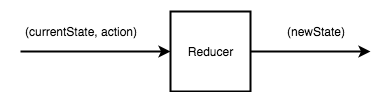
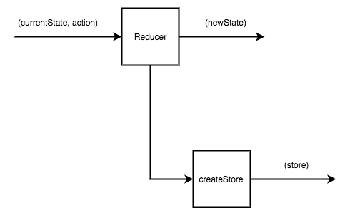
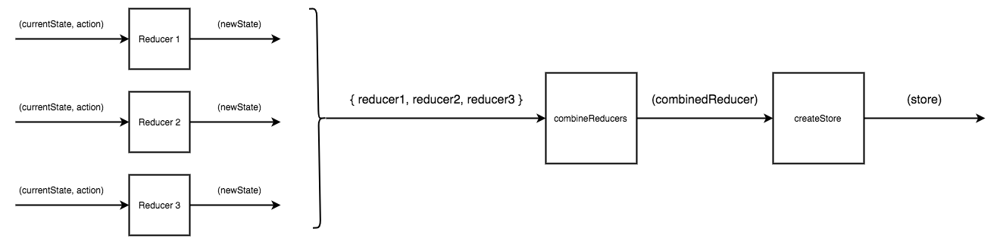
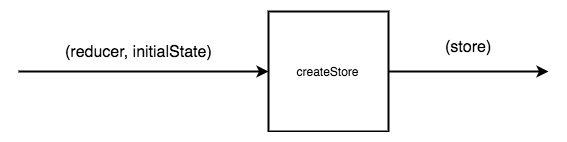

## Using `redux` to keep track of the state

These are the key parts of the application:

### Constants

Using [constants](./src/constants.js). We define the action verbs and other constants. Hence we avoid using string
literals in the rest of our code. The use of constants instead of literals helps us find bugs early.

### Reducers

[Reducers](./src/reducers.js)

- We have one reducer for each one of the nodes of the state tree
- The reducer takes as input the current state representation, for the node type the reducer is dealing with. Also, it takes
as input the action. Given the action and the current state, it has to return the new state.



### Store

There is only one store when using Redux. The function to create a store is called `createStore()` and takes as input a
reducer:



### Combine Reducers

Store can combine many reducers. We use `combineReducers` to do that, and then we call `createStore()` with the combined
reducer.



### Initial State

When creating a store, one can define the initial state as the second argument to `createStore()`:

.

### store API

#### Get Current State - `getState()`

`store.getState()`

#### Dispatch an Action - `dispatch()`

`store.distach({.....<action>.....})`

#### Register Subscribers/Handling Functions - `subscribe()`

`store.subscribe(<function definition>)`

These are invoked every time a store completes a dispatching action.

The result of calling this method is a function reference to an unsubscribe functionality. E.g.

``` javascript
const unsubscribe = store.subscribe(() => console.log(store.getState()));
// unsubscribe, later on, if you are no longer interested
unsubscribe();
``` 

### `compose()`

Allows one to compose many functions into one. Example:

``` javascript
import {compose} from 'redux';

const print = compose(
    list => console.log(list)
    titles => titles.join(', '),
    map => map(c => c.title),
    colors => colors.map.bind(colors),
    state => state.colors
);

print(store.getState());
```

### `applyMiddleware()`

A middleware in Redux is defined as a higher order function. It is a function that returns a function that returns a function. The
last function defined is the one that is being logged every time an action is dispatched. I.e. every time we call
`store.dispatch({....action....})`, in order to update the application state.

See for example the [`storeFactory.js`](./src/storeFactory.js). It defines two middleware functions, which are applied
using the `applyMiddleware()`.

### Redux context

Allows us to pass variables to components without having to explicitly pass them down the tree as properties. Any child component
can access these context variables.

### Redux Provider - `react-redux`

....

### Redux Provider - `react-redux` - `connect()` function

....


